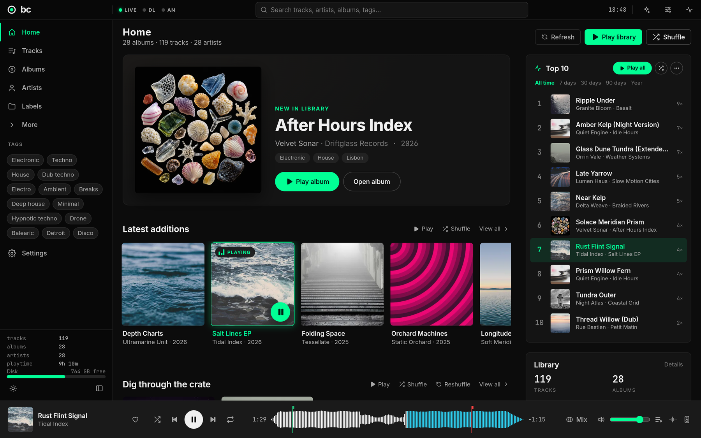

<p align="center">
  
</p>
<h1 align="center">bc</h1>
<p align="center"><b>bandcamp library &amp; dj tool for linux and macos</b><br>
<a href="#installing">Install</a> · <a href="#using-it">Manual</a></p>



bc is an app for Linux and macOS for finding and downloading music on Bandcamp,
managing a local music library, analyzing tracks, and playing and building DJ sets. It is
written in Rust and replaces an earlier Python/React version of bc.

## What it does

- **Library.** Scans your music folders (tags, cover art) into SQLite with
  full-text search. Sorting and filtering run on the server, so the track list
  has no row limit. Albums, artists, labels, tags, loved tracks,
  favourites, play history, Top 10, crate dig, metadata editing with dry run
  and undo, cleanup of junk and strays, completeness checks and moving library
  roots.
- **Bandcamp.** Explore searches Bandcamp and browses its tag pages with
  streaming previews. The Feed follows artists and labels, Fans walks the
  collections and wishlists of other fans ("shelves" keep their downloads out
  of your own library), Harvest collects artists, labels, discover feeds,
  collections and wishlists into an inbox, and Tracklists matches uploaded
  tracklists to releases. Requests are rate-limited and cached. Response
  bodies are checked for errors because Bandcamp returns them with HTTP 200.
- **Downloads.** A job queue stored in SQLite that resumes after a crash. Each
  file is written to `.part`, tagged, and then renamed, so an interrupted
  download does not leave a partial file. Releases you bought come from your
  collection in the format you pick (FLAC, MP3 320, WAV, ...); everything else
  is Bandcamp's public stream. `bandcamp-dl` can be used instead of the
  built-in downloader. The queue pauses when disk space runs low.
- **Analysis.** One decode pass per track: tempo, beats, downbeats and
  phrases, Camelot key, energy, EBU R128 loudness with true peak, and a
  three-band waveform at about 172 points per second on an absolute dB scale.
- **Player.** Audio engine on cpal with gapless playback, EQ, filter, echo,
  limiter, key lock and five transition types. An optional second output
  device pre-listens on headphones while the main output keeps playing. Queue, history, shuffle and
  auto-fill. Media keys (MPRIS on Linux, Now Playing on macOS) and a tray icon on
  Linux. The same DSP code runs in the
  browser as an AudioWorklet, so a phone can play through its own speaker.
- **DJ sets.** Automix orders a pool of tracks by key and tempo compatibility
  (beam search). Sets can be edited in Plan or on the two-lane Arrange
  timeline. The live planner handles up next, wishes, tag rules, pools and a
  set clock. Sets can be rendered to WAV or MP3.
- **Recommendations.** Next up, similar tracks and taste, computed locally.
- **Desktop and phone.** `bc-desktop` runs the server and opens the UI in a
  native window on macOS, or in a Chromium or Firefox app window on Linux.
  With a Chromium-family browser, bc installs itself as a web app of its own
  browser profile on first start. Click the chevron in the window's title strip
  once and bc's header becomes the title bar.
  `bc-rust serve --lan` serves the UI to other devices on
  the local network after a one-time pairing.

## Installing

On Linux, download `bc-linux-x86_64.AppImage` from the latest GitHub release,
make it executable (`chmod +x`) and run it. It needs a Chromium-family browser
or Firefox for the app window, and `libfuse2` on distributions that do not ship
it. To build from source instead, the requirements are: Rust (stable) with the `wasm32-unknown-unknown` target, `trunk`,
`wasm-bindgen`, `brotli`, `clang`, `pkgconf`, and the ALSA, OpenSSL and D-Bus
development files. At runtime: a Chromium-family browser (Chromium, Google
Chrome, Brave, Edge or Vivaldi) or Firefox for the app window, and optionally
`ffmpeg` (MP3 set renders, formats bc cannot decode itself) and `bandcamp-dl`.

```sh
./scripts/install.sh            # builds the UI and the app, installs into ~/.local
bc-desktop
```

On Arch Linux, `makepkg -si` in `packaging/` builds and installs a package
(`bc-desktop`, the `bc-rust` command line tool and the icons). The command
line tool is called `bc-rust` because `bc` is the GNU calculator.

`./packaging/appimage/build-appimage.sh` builds the AppImage
(`target/appimage/bc-linux-x86_64.AppImage`). The release workflow
(`.github/workflows/release.yml`) builds the macOS disk image and the AppImage
and attaches them to the GitHub release of every `v*` tag; it can also be
started by hand from the Actions tab.

### macOS

Download `bc-macos-arm64.dmg` from the latest GitHub release (Apple silicon,
macOS 12 or later) and drag bc to Applications. The app is not notarized:
allow the first launch under System Settings → Privacy & Security → Open
Anyway. On macOS bc shows its UI in a native window (WebKit), so no other
browser is needed. Closing the window keeps music playing; the dock icon
brings it back and ⌘Q quits. Play/pause and next track are in the
**Controls** menu.

The command line tool is inside the app bundle:
`/Applications/bc.app/Contents/MacOS/bc-rust`. `ffmpeg` and `bandcamp-dl`
from Homebrew are found without changes to `PATH`.

To build it yourself (Rust with the `wasm32-unknown-unknown` target, `trunk`,
`brotli` and the Xcode command line tools, e.g. `brew install trunk brotli`):

```sh
./packaging/macos/build-app.sh  # → target/macos/bc.app and bc-macos-arm64.dmg
```

### Uninstalling

Quit bc first. Then remove the app the way it was installed:

```sh
# AppImage: delete the file
rm ~/Downloads/bc-linux-x86_64.AppImage   # wherever you put it

# scripts/install.sh (use the same PREFIX, and sudo, if you changed it)
PREFIX=~/.local
rm -f "$PREFIX"/bin/{bc-desktop,bc-rust,bc-analysis-tool} \
      "$PREFIX"/share/applications/bc.desktop \
      "$PREFIX"/share/icons/hicolor/*/apps/bc.{png,svg}
rm -rf "$PREFIX"/share/licenses/bc-rust

# Arch package
sudo pacman -R bc-rust

# macOS
rm -rf /Applications/bc.app
```

This leaves your library database, settings, caches and downloads in place,
so a later install picks up where you left off. To remove those as well (this
deletes `library.db` and everything under `BC_DATA_DIR`, including downloads
unless `BC_DOWNLOAD_DIR` points elsewhere; your own music folders are not
touched):

```sh
# Linux
rm -rf ~/.local/share/bc-rust            # data, caches, backups, browser profiles
# the launcher entry Chromium created for the bc web app, if any
grep -l 'bc-rust/window-profile' ~/.local/share/applications/*.desktop | xargs -r rm
secret-tool clear service bc-rust        # Bandcamp sign-in in the keyring

# macOS
rm -rf ~/Library/Application\ Support/bc-rust \
       ~/Library/Caches/io.github.birkmann.bc ~/Library/WebKit/io.github.birkmann.bc
security delete-generic-password -s bc-rust   # Bandcamp sign-in in the Keychain
```

## Using it

1. Open **Settings → Library** and add the folder that holds your music. It
   is scanned in the background, then analyzed.
2. For collections, wishlists and the feed, click **Sign in to Bandcamp**
   under **Settings → Bandcamp**. In the desktop app this opens Bandcamp's own
   sign-in page in a window, and bc keeps only the login cookie, never the
   password. In a browser on another device, paste the `identity` cookie
   instead. The cookie is stored with 0600 permissions or in the system
   keyring, is never logged, and is only sent to `*.bandcamp.com`. Once you
   are signed in, pick a **Download quality** there: releases you bought are
   then downloaded from your collection in that format.
3. Browse **Explore, Feed and Fans**; queue what you want under
   **Downloads**. Finished downloads are added to the library automatically.
4. Double-click any track to play it. **DJ Sets → New set** starts a set:
   add tracks, press **Automix**, then fine-tune in **Arrange**. To pre-listen
   on headphones, choose a **Cue / headphones** device under
   **Settings → Audio**.

Keyboard (while not typing): <kbd>Space</kbd> play/pause, <kbd>←</kbd>/<kbd>→</kbd>
seek, <kbd>Shift</kbd>+<kbd>←</kbd>/<kbd>→</kbd> previous/next, <kbd>/</kbd>
search, <kbd>Q</kbd> planner, <kbd>S</kbd> similar tracks, <kbd>V</kbd> deck
view, <kbd>X</kbd> cut to the next track now.

### Command line

```sh
bc-rust serve [--lan]      # UI and API on http://127.0.0.1:8420
bc-rust scan               # scan library roots for new, changed and missing files
bc-rust doctor             # integrity, counts, index plans, orphans
bc-rust analyze --gate     # analysis accuracy gate (runs bc-analysis-tool)
bc-rust bandcamp-replay    # re-run the Bandcamp extractors over cached pages, offline
bc-rust import --from ~/.local/share/bcapp/library.db   # import the previous app's library
```

### Configuration

Data lives in `~/.local/share/bc-rust` on Linux and in
`~/Library/Application Support/bc-rust` on macOS (`library.db`, caches,
backups). Environment variables override the defaults:

| Variable | Default | |
|---|---|---|
| `BC_DATA_DIR` | see above | database, caches, backups |
| `BC_DOWNLOAD_DIR` | `$BC_DATA_DIR/downloads` | where downloads land |
| `BC_HOST`, `BC_PORT` | `127.0.0.1`, `8420` | server address |
| `BC_AUDIO` | (system default) | `null` runs without an audio device |
| `BC_MPRIS` | `1` | `0` disables media keys |
| `BC_FFMPEG_BIN` | `ffmpeg` | used for MP3 renders and as a decode fallback |
| `BC_BANDCAMP_DL_BIN` | `bandcamp-dl` | the alternative downloader |
| `BC_ESSENTIA_PYTHON` | — | a Python with essentia, for reference BPM/key |
| `BC_HARVEST_RATE_PER_SEC` | `0.67` | Bandcamp request rate |
| `BC_DESKTOP_BROWSER` | (first found) | Linux: browser for the app window, Chromium family or Firefox |

Tempo and key come from bc's own analyzer. If `BC_ESSENTIA_PYTHON` points at a
Python with essentia installed, new tracks use essentia's values instead and
the native ones are kept as a fallback.

## Development

A Cargo workspace of 23 crates in `crates/`:

| Layer | Crates |
|---|---|
| Shared | `bc-types` (DTOs, wasm-safe), `bc-core` (config, path safety, event bus) |
| Data & library | `bc-db`, `bc-libcore`, `bc-library`, `bc-media`, `bc-scan`, `bc-maint`, `bc-plist`, `bc-meta`, `bc-cli` |
| Bandcamp & jobs | `bc-bandcamp`, `bc-jobs` |
| Analysis & music | `bc-analysis`, `bc-waveform`, `bc-music`, `bc-recommend` |
| Audio | `bc-dsp`, `bc-engine`, `bc-worklet` |
| App | `bc-server` (axum, WebSocket hub, embedded UI), `bc-ui` (Leptos, WebAssembly), `bc-desktop` (browser window on Linux, WebKit window on macOS) |

```sh
cargo test --workspace         # unit and integration tests
scripts/build-ui.sh            # worklet + UI into crates/bc-ui/dist (embedded by bc-server at compile time)
cargo run -p bc-cli -- serve   # then open http://127.0.0.1:8420
scripts/e2e.sh <db-copy>       # screenshots of every page and perf probes (Playwright, see e2e/)
```

`scripts/e2e.sh` runs on a copy of a library database and disables its library
roots first (`scripts/safe-db.sh`), so tests never touch real files. API notes
per area are in `docs/api/`; the `.bcw2` waveform format is described in
`docs/api/waveform-format.md`.

## Known limitations

- Purchase-quality downloads need you to be signed in to Bandcamp and the
  built-in downloader. A track bought on its own is only found when it is queued with
  **Tracks only**; otherwise it is widened to its album and comes from the
  stream.
- On a real library the native key matches essentia on about 93 % of tracks,
  but the tempo matches within 0.5 % on only about 82 % (93 % within 3 %). For
  essentia's tempo, see `BC_ESSENTIA_PYTHON` above.
- WebKitGTK is not used for the desktop window on Linux (it was not reliable
  on Wayland with NVIDIA drivers). In Firefox the window frame does not take
  the app's colours the way a Chromium app window does.
- The macOS app is signed ad hoc, not notarized, and built for Apple silicon
  only. Because the signature changes with every build, the Keychain asks
  again for access to the stored Bandcamp cookie after an update.

## License

MIT, see [LICENSE](LICENSE). Copyright (C) 2026 The bc-01 contributors.

The bundled Inter and JetBrains Mono fonts are under the SIL Open Font License
(`crates/bc-ui/assets/fonts/`).

bc is an independent project and is not affiliated with or endorsed by
Bandcamp.
